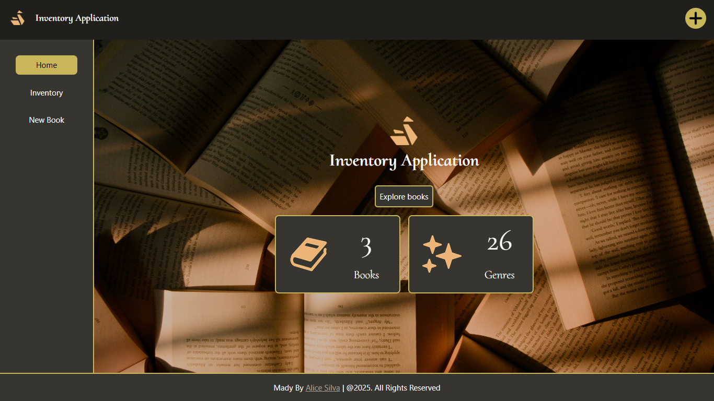
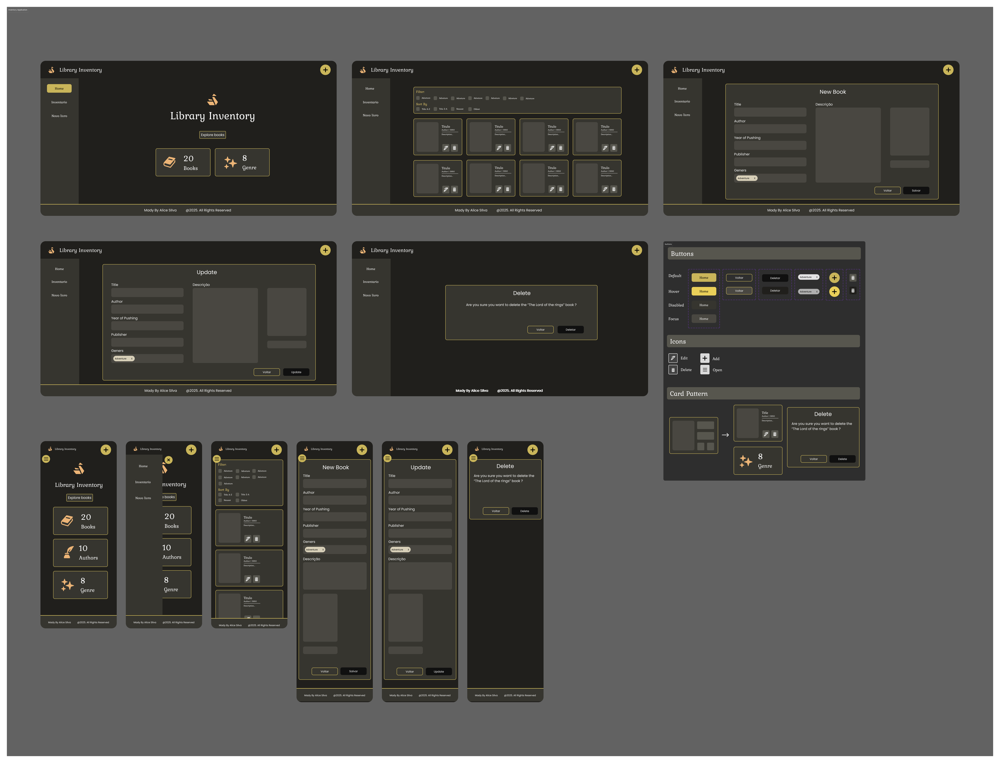
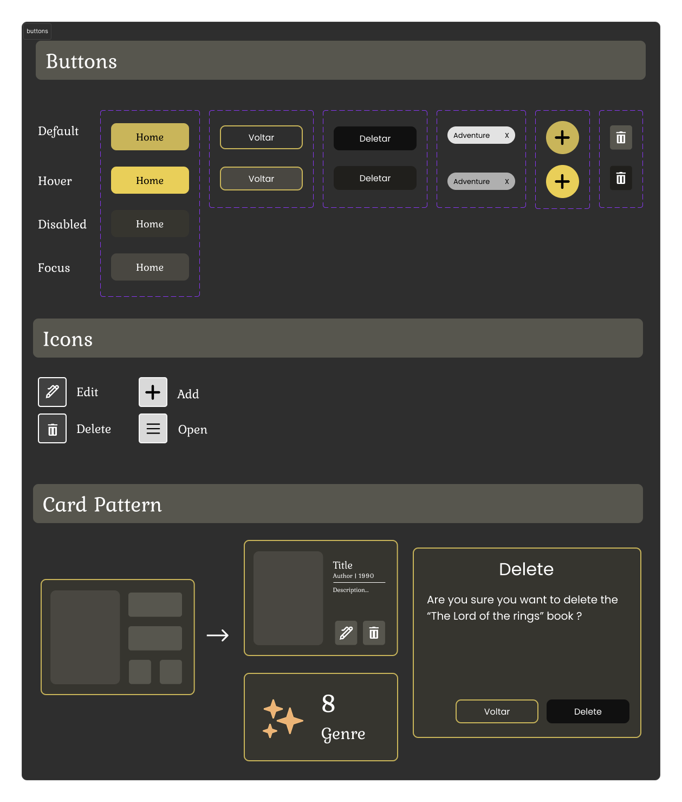
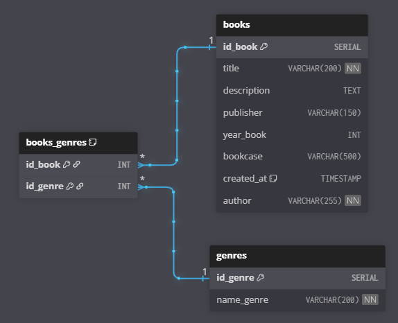

# Inventory Application

A complete full-stack bookstore inventory system built with Express and PostgreSQL (Neon), offering CRUD operations, image uploads, sorting, filtering, and elegant server-rendered interfaces using EJS + Tailwind CSS.

Although developed as part of The Odin Project, the codebase follows a clean, production-oriented MVC architecture.


## Live Demo

`Vercel`: []()

## Tech Stack & Tools


## Main Page



### Design

<details>
<summary>High Fidelity Prototype</summary>

</details>

<details>
<summary>Design System</summary>

</details>

## Features

- Create, edit, delete books (CRUD)
- Upload cover images (Multer)
- Metadata support: title, author, year, genre, description
- Full validation with express-validator

### Search, Filter & Sort

- Filter books by genres
- Sort options:
  - Title (A–Z / Z–A)
  - Year (Oldest / Newest)

### Database Layer

- PostgreSQL hosted on **NeonDB**

### UI (Tailwind + EJS)

- Tailwind CSS v4
- Modern, minimal, responsive UI
- Clean EJS templates

## Tech Stack

### Backend

- Node.js
- Express 5
- Express Validator
- Multer (image uploads)
- PostgreSQL (NeonDB)

### Frontend

- EJS
- Tailwind CSS 4
- Vanilla JavaScript

## Folder Structure

<details>
  <summary>Folder Structure</summary>
 
  ```
  books-inventory/
  │
  ├─ app.js
  ├─ package.json
  |
  ├─ db/
  │   └─ pool.js
  │
  ├─ controllers/
  │   ├─ indexController.js
  │   └─ booksController.js
  |
  ├─ services/
  │   └─ booksService.js
  |
  ├─ repository/
  │   └─ booksRepository.js
  |
  ├─ utils/
  │   └─ normalizeGenre.js
  |
  ├─ routes/
  │   ├─ booksRouter.js
  │   └─ indexRouter.js
  │
  ├─ validators/
  │   └─ booksValidators.js
  │
  ├─ middlewares/
  │   └─ upload.js
  │
  ├─ public/
  │   ├─ js/
  |   │   └─ sidebar.js
  │   ├─ css/
  |   |   ├─ style.css
  |   |   └─ custom.css
  │   ├─ uploads/ <- bookcovers
  |   └─ img/
  |
  └─ views/
      ├─ components/
      |    ├─ cardsBooks.ejs
      |    ├─ footer.ejs
      |    ├─ navbar.ejs
      |    ├─ form.ejs
      |    └─ sidebar.ejs
      |
      ├─ updateBook.ejs
      ├─ index.ejs
      ├─ createBook.ejs
      ├─ books.ejs
      └─ deleteBook.ejs

  ```

</details>

## Architecture validation


## Database Schema


<p><i>https://dbdiagram.io/d</i></p>

## Setup & Installation

1. Clone the repository

```bash
git clone https://github.com/AliceSilva/books-inventory.git
cd books-inventory
```

2. Install dependencies

```bash
npm install
```

3. Create `.env`

```
DATABASE_URL=your_neon_connection_string
PORT=8080
```

## Running the Project

Development mode (server + Tailwind watcher)

```bash
npm run dev
```

Build Tailwind for production

```bash
npm run css:build
```

Start server normally

```
npm start
```

Server runs at:

```
http://localhost:6969
```

## Image Upload System

- Uploads stored in: `public/uploads/`
- Max file size: **5MB**

## License

**MIT License** — free to modify & share.